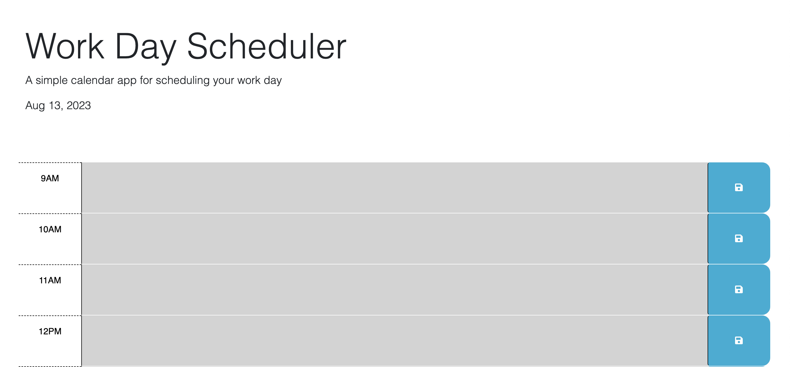
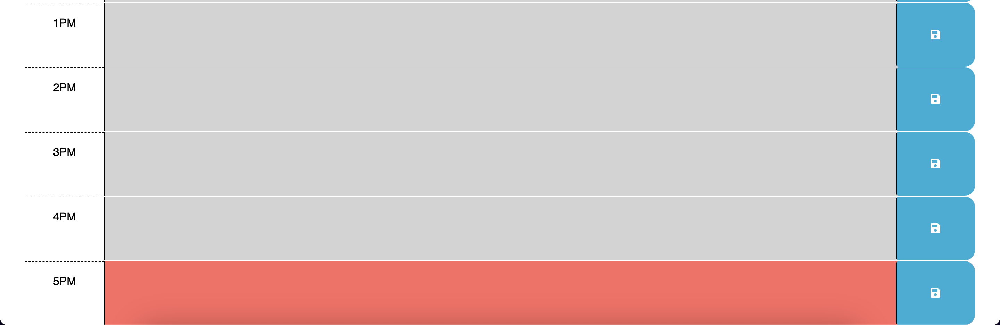

# Work Day Scheduler Starter Code

This is an app that creates a schedule for users

## Link to Deployed Application
<a href="https://yega1009.github.io/Work-Day-Scheduler/">Work Day Scheduler</a>

## Description
- I completed the javasript code to enable the functions of creating a daily planner.
- It enables users to add and save events in the displayed timeblocks from 9am to 5pm.
- During this process, I gained an understanding for calling jquery functions, using dayjs and the local storage property to handle the functionality of a calendar application.

## Installation

N/A

## Usage
- This application enables users to utilize a daily scheduler.
- The time-blocks are color-coded such that it indicates whether a specific time block is in the past, present, or future.
- Users can add events by typing in the time-blocks for the hour.
- Users can save the events by clicking on the save button.
- When user refreshes the page, the saved events persist.

## Screenshot of the Website

## Credits

N/A

## License

Please refer to the LICENSE in the repo.
